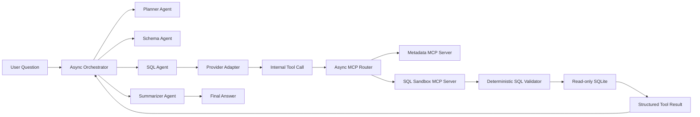

# FieldOps SQL Sandbox

FieldOps SQL Sandbox is a precision-agriculture analytics backend that answers
natural-language questions over field operations data using an asynchronous
multi-agent architecture. Native LLM tool-calling schemas are normalized into
an internal protocol and routed to isolated MCP servers for metadata access and
read-only SQL execution.

The project is designed as a small but realistic MVP:

- Gemini is the live model provider.
- SQLite is the local analytical database.
- MCP servers are isolated stdio processes.
- Generated SQL is treated as untrusted and validated deterministically before
  execution.

## What It Does

- Builds a reproducible local FieldOps database with crops, missions, weed
  detections, spray events, equipment alerts, and weather/crop context.
- Exposes metadata and SQL capabilities behind separate MCP server boundaries.
- Maps provider-native tool schemas into a provider-neutral internal tool
  protocol.
- Routes tool calls asynchronously to the correct MCP server.
- Supports a deterministic end-to-end demo and a live Gemini-backed query path.

## Architecture



## Project Structure

- `src/fieldops/data`
  Database schema and local data builder.
- `src/fieldops/mcp_servers`
  Metadata and SQL sandbox MCP servers.
- `src/fieldops/security`
  SQL validation and read-only execution safeguards.
- `src/fieldops/tools`
  Internal tool protocol plus Gemini/OpenAI-style adapters.
- `src/fieldops/mcp_client`
  Async stdio MCP router and server registry.
- `src/fieldops/agents`
  Provider abstraction, tool catalog, and multi-agent orchestrator.
- `tests`
  Unit and integration coverage across all major layers.

## Quick Start

1. Install dependencies:

```bash
uv sync --extra dev
```

2. Build the local database:

```bash
uv run fieldops build-db --mode offline
```

3. Inspect the database:

```bash
uv run fieldops db-summary
```

4. Run the deterministic demo:

```bash
uv run fieldops demo
```

5. Run the full test suite:

```bash
uv run pytest
uv run ruff check .
```

6. Run a live Gemini-backed question:

```bash
export GEMINI_API_KEY=...
uv run fieldops ask "Which fields had the highest weed pressure?"
```

## Data Sources

The local database is reproducible by default and uses a mix of deterministic
seed data plus fixture data shaped around public sources:

- USDA NASS QuickStats for crop statistics
- NASA POWER Daily API for weather context

The default offline mode keeps local builds stable. The builder also leaves room
for refreshing crop statistics when a `NASS_API_KEY` is available.

## Security Model

- Tool execution is isolated behind MCP servers.
- Metadata and SQL execution are split into separate MCP processes.
- SQL is parsed with `sqlglot`, not trusted as plain text.
- Only read-only `SELECT` queries are allowed.
- Multiple statements, write operations, admin commands, and unknown tables are
  rejected.
- SQLite execution uses `mode=ro` and `PRAGMA query_only = ON`.
- Row limits are enforced and long-running queries are interrupted via a
  timeout-aware progress handler.
- MCP tools do not expose arbitrary database path overrides.

## CI

GitHub Actions runs on pull requests and pushes to `main`:

- `uv sync --extra dev --frozen`
- `uv run pytest`
- `uv run ruff check .`

## Review Guide

The fastest path for a reviewer is:

1. Read [docs/architecture.md](/Users/abdullahsohail/LUMS/Senior%20Courses/precisionai_task/fieldops-sql-sandbox/docs/architecture.md)
2. Read [docs/threat-model.md](/Users/abdullahsohail/LUMS/Senior%20Courses/precisionai_task/fieldops-sql-sandbox/docs/threat-model.md)
3. Run `uv run fieldops demo`
4. Inspect the merged PR history for each issue-sized increment

## Limitations

- The live Gemini provider path currently uses prompt contracts plus the
  internal tool protocol, not an advanced conversation memory layer.
- The demo database is intentionally small and local.
- SQL execution is restricted to read-only analytics; writes are explicitly out
  of scope for this MVP.
- MCP servers are local stdio processes for the MVP, not remote services.

